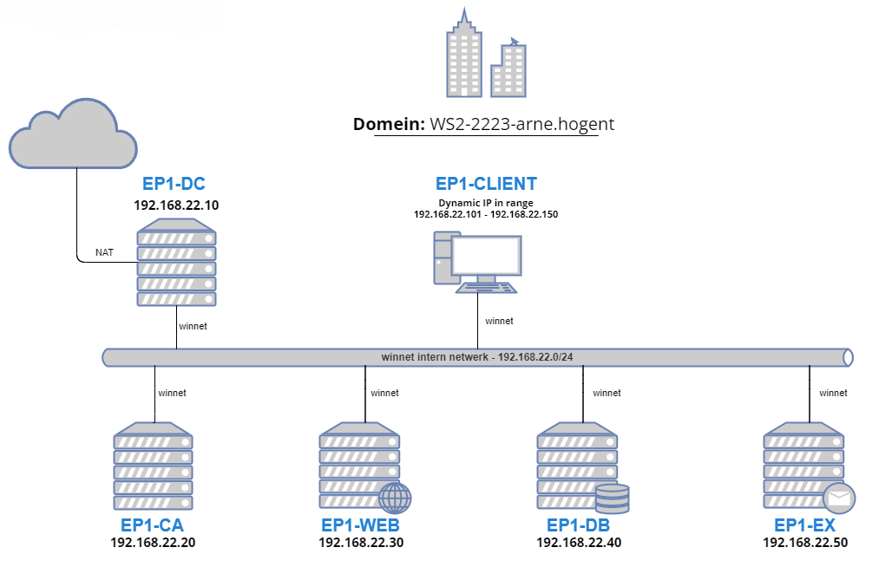
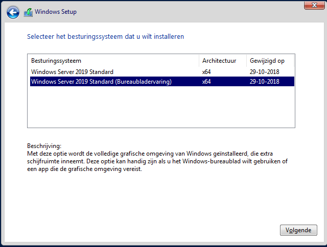
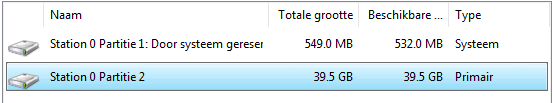

# Documentatie van de installatie en configuratie  <!-- omit in toc -->

Dit document bevat een documentatie van de installatie en configuratie van onderstaande Windows omgeving. Er zal voor elk van de hosts overlopen worden welke rollen ze krijgen binnen het domein en hoe ze geconfigureerd werden om tot een werkende opstelling te komen.

## Inhoudsopgave <!-- omit in toc -->

- [1. Installatie van Windows Server 2019 op VM](#1-installatie-van-windows-server-2019-op-vm)
  - [1.1. Desktop Experience](#11-desktop-experience)
  - [1.2. Headless (zonder GUI)](#12-headless-zonder-gui)

## 1. Installatie van Windows Server 2019 op VM

In dit domein wordt er gebruik gemaakt van 3 Virtuele machines waarop Windows Server 2019 draait als besturingssysteem. In het volgende hoofdstuk wordt beschreven hoe men Windows Server installeert op deze VM's. Zowel de Desktop Experience als de Headless installatie worden doorlopen.

### 1.1. Desktop Experience

In bovenstaande opstelling wordt Windows Server 2019 met **Desktop Experience (GUI)** enkel geïnstalleerd op de domeincontroller `EP1-DC`. De installatie op Certificate Authority `EP1-CA` en ISS Webserver `EP1-WEB` betreft een Headless installatie (zonder GUI). De specificaties per VM zijn te vinden in [Opstelling.pdf](Opstelling.pdf).

Na het opstarten van de VM met de Windows ISO geladen in het virtueel optisch station krijgen we de mogelijkheid om de taal, tijd en valuta en toetsenbord instellingen aan te passen. Klik op `Volgende` na het kiezen van uw voorkeuren. Klik op `Nu installeren` om de setup te starten. Na het ingeven van de licentiecode verschijnt volgend scherm. Kies hier voor `Bureaubladervaring` en klik `Volgende`.

Accepteer vervolgens de licentievoorwaarden en kies voor het installatietype `Aangepast: alleen Windows installeren (geavanceerd)`. Zo zal er een verse installatie van Windows uitgevoerd worden op onze VM.

Het volgende scherm betreft de partities aanmaken op onze virtuele harde schijf. Momenteel zijn er nog geen partities aangemaakt en is alle ruimte op de virtuele harde schijf nog niet toegewezen. Selecteer de ruimte van het station en klik op `Nieuw`. Ik kies in dit geval om de volledige schijf toe te kennen aan 1 partitie. Windows creëert automatisch een partitie dat gereserveerd is voor het systeem. Als er later een extra partitie nodig zou zijn, kunnen we deze nog aanmaken in Windows zelf.

Klik op `Volgende`. De setup begint nu met het installeren van Windows. Dit kan enige tijd in beslag nemen. Na het kiezen van een wachtwoord voor de Administrator gebruiker belanden we op het loginscherm. De installatie is nu voltooid. 

Binnen de context van dit domein koos ik er ook voor om Windows Updates uit te schakelen op alle servers door de `Update Orchestrator Service` te stoppen. Updates kunnen namelijk een groot deel resources gebruiken, tijdelijk de server onbereikbaar maken en ze zijn bovendien niet noodzakelijk binnen deze opdracht.

### 1.2. Headless (zonder GUI)

De headless installatie verloopt redelijk analoog met de desktop experience.
