# Portfolio Windows Server II <!-- omit in toc --> <!--

-->

- [1. De Opstelling](#1-de-opstelling)
  - [1.1. Minimale systeemvereisten](#11-minimale-systeemvereisten)
  - [1.2. Algemene netwerkconfiguratie](#12-algemene-netwerkconfiguratie)
  - [1.3. VM 1: Domain Controller](#13-vm-1-domain-controller)
    - [1.3.1. Configuratie in VirtualBox](#131-configuratie-in-virtualbox)
    - [1.3.2. Geïnstalleerde Server Rollen](#132-geïnstalleerde-server-rollen)
      - [1.3.2.1. Active Directory Domain Services (AD DS)](#1321-active-directory-domain-services-ad-ds)
      - [1.3.2.2. DNS-server](#1322-dns-server)
      - [1.3.2.3. DHCP-server](#1323-dhcp-server)
      - [1.3.2.4. Web Server (IIS)](#1324-web-server-iis)
  - [1.4. VM 2: Certificate Authority + SQL Server](#14-vm-2-certificate-authority--sql-server)
    - [1.4.1. Configuratie in VirtualBox](#141-configuratie-in-virtualbox)
    - [1.4.2. Geïnstalleerde server rollen](#142-geïnstalleerde-server-rollen)
      - [1.4.2.1. Active Directory Certificate Services (AD CS)](#1421-active-directory-certificate-services-ad-cs)
      - [1.4.2.2. SQL Server](#1422-sql-server)
      - [1.4.2.3. DNS](#1423-dns)
  - [1.5. VM 3: Exchange](#15-vm-3-exchange)
    - [1.5.1. Configuratie in VirtualBox](#151-configuratie-in-virtualbox)
    - [1.5.2. Geïnstalleerde server rollen](#152-geïnstalleerde-server-rollen)
      - [1.5.2.1. Exchange mail server](#1521-exchange-mail-server)
  - [1.6. VM 4: Windows Client](#16-vm-4-windows-client)
    - [1.6.1. Configuratie in VirtualBox](#161-configuratie-in-virtualbox)
    - [1.6.2. Geïnstalleerde software](#162-geïnstalleerde-software)
      - [1.6.2.1. SQL Server Management Studio](#1621-sql-server-management-studio)
  - [1.7. Netwerk Diagram](#17-netwerk-diagram)

## 1. De Opstelling

### 1.1. Minimale systeemvereisten

- **CPU:** Processor met 12 kernen
- **RAM:** 10 GB
- **Disk:** 150 GB

### 1.2. Algemene netwerkconfiguratie

- **VirtualBox internal network:** 192.168.22.0/24
  - **Server (STATIC) range:** 192.168.22.1 - 192.168.22.100
  - **Client (DHCP) range:** 192.168.22.101 - 192.168.22.150
  - **Closed range:** 192.168.22.151 - 192.168.22.255

### 1.3. VM 1: Domain Controller

Deze virtuele machine zal de domeincontroller worden van het domein `WS2-2223-arne.hogent`. De server zal **Windows Server 2019 (Desktop Experience)** draaien als besturingssysteem. Merk op dat ik hier kies voor de Desktop Experience. Dit betekent dat Windows Server geïnstalleerd zal worden **mét GUI**. De andere servers in deze opstelling zullen Headless (zonder GUI) geïnstalleerd worden. Naast de rol als **Active Directory Domain Controller** zal de server ook instaan als **main DNS server**, **DHCP server** en als **IIS webserver**.

#### 1.3.1. Configuratie in VirtualBox

Om al deze services vlot te laten draaien wordt de VM voorzien van **twee virtuele CPU's** en **2 GB vRAM**. Dit is ruim boven de minimum requirements dat Microsoft aanbeveelt voor Windows Server 2019 (1 CPU en 512 MB RAM) en zou moeten volstaan voor de te installeren rollen. Microsoft raadt bovendien aan om de VM te voorzien van minstens 32 GB aan disk space. Dit is een aanbeveling op basis van Windows Server 2019 core installatie met de IIS webservices server rol. Omdat VirtualBox over de optie beschikt om vDisks dynamisch te alloceren, heb ik hier gekozen voor een **dynamische vDisk van 50 GB**.

Deze server is binnen dit domein de enige server die over **twee NIC's** zal beschikken. Eén netwerkadapter zal instaan voor NAT en zal dus de brug vormen tussen het virtueel `winnet` netwerk en de host machine. Het tweede netwerkadapter zal geconfigureerd worden met een IP adres binnen het `winnet` netwerk, meer bepaald `192.168.22.10`.

- **Hostname:** EP1-DC
- **OS:** Windows Server 2019 64-bit (Desktop Experience)
- **vCPUs:** 2
- **vRAM:** 2048 MB
- **vDisk:** 50 GB (Dynamically allocated)
- **Network:**
  - **Adapter 1:** NAT
    - **IP adres:** 10.0.2.15
  - **Adapter 2:** Intern netwerk (winnet)
    - **IP adres:** 192.168.22.10

#### 1.3.2. Geïnstalleerde Server Rollen

Na het aanmaken van de VM en het installeren van **Windows Server 2019 Standard (Desktop Experience) x64** gaan we over naar het installeren en configureren van de besproken server rollen.

Zoals eerder besproken zal deze server verschillende rollen vervullen binnen het domein. Eerst en vooral installeren we dus de `Active Directory Domain Services`, `DHCP-server`, `DNS-server` en `Web Server (IIS)` rollen. Verder zijn ook de `beheerhulpprogramma's voor externe servers` voor de Certificate Authority geïnstalleerd. Zo kan men de CA beheren vanop de domeincontroller.

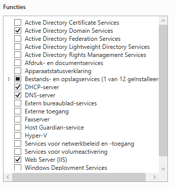
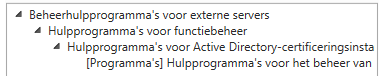

##### 1.3.2.1. Active Directory Domain Services (AD DS)

Vervolgens promoveren we de server tot een domeincontroller en maken we een nieuw forest aan met functionaliteitsniveau `Windows Server 2016` zodat de andere Windows Server 2019 servers kunnen toetreden tot het domein en het domein eventueel uitgebreid kan worden met oudere versies van Windows Server. Het `Directory Services Restore Mode (DSRM) password` stel ik in op `Admin2223`. Binnen deze opdracht hanteren we geen subdomains, dus DNS delegatie maken we voorlopig niet aan. De AD DS database, log files en SYSVOL folders zijn de volgende.

- Database folder: **C:\Windows\NTDS**
- Log files folder: **C:\Windows\NTDS**
- SYSVOL folder: **C:\Windows\SYSVOL**

##### 1.3.2.2. DNS-server

De domein controller biedt ook een DNS service aan vanaf deze server. DNS zorgt ervoor dat hosts op het netwerk bereikbaar zijn aan de hand van een URL  zoals `ep1-dc.ws2-2223-arne.hogent` in plaats van enkel het IP adres. Er zijn **twee zones** geconfigureerd. Enerzijds een `forward lookup zone`, anderzijds een `reverse lookup zone`. In de forward lookup zone bevinden zich de A-records en in de reverse lookup zone staan de bijhorende PTR-records.

De zones op deze VM zijn **primaire IPv4** zones en worden gerepliceerd naar alle DNS-servers die binnen het domein `WS2-2223-arne.hogent` uitgevoerd worden op domein controllers. Zo is er minder configuratie vereist indien er een tweede domein controller opgezet zou worden.

De DNS-server is uiteraard actief op het interne netwerk `192.168.22.0/24` en dus enkel op het tweede netwerkadapter. Verder laat de server alleen maar **beveiligde dynamische updates** toe.

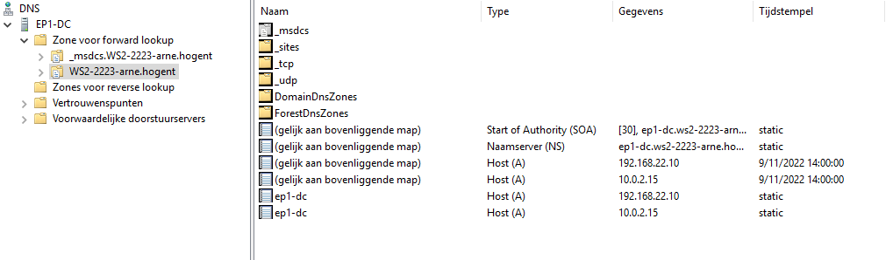

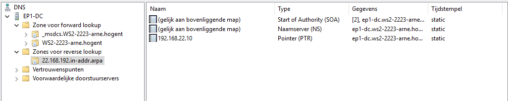

De server heeft zijn DNS-server ingesteld met het loopback adres `127.0.0.1`. Indien het IP-adres van de VM zou veranderen, zou de DNS-server zo nog altijd werken.

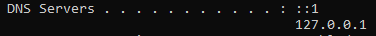

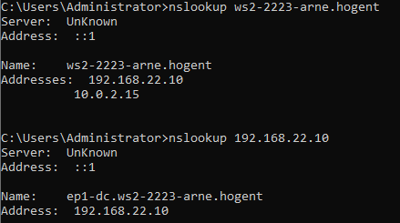

##### 1.3.2.3. DHCP-server

De DHCP-server rol zorgt ervoor dat apparaten binnen het domein een IP adres toegewezen krijgen. Binnen deze domeincontroller zijn er een aantal DHCP scopes geconfigureerd zoals gedefinieerd in de opdracht. Deze scopes definiëren een range van IP adressen die toegewezen kunnen worden aan hosts die via DHCP een IP adres aanvragen. De DHCP-server is eveneens **geauthoriseerd** binnen Active Directory.

Binnen DHCP is er **één scope** geconfigureerd. Dit is een **IPv4** scope die gaat van `192.168.22.1` tot en met `192.168.22.254`. De scope is bovendien zo geconfigureerd dat er twee ranges uitgesloten worden. Dit betekent dat deze adressen niet door de server uitgedeeld kunnen worden. De range `192.168.22.1 - 192.168.22.100` is 'gereserveerd' voor servers. Deze krijgen hun vast IP lokaal toegekent en moeten dus niet via DHCP gaan. De range `192.168.22.151 - 192.168.22.254` is de closed range. Deze bevat IP adressen die niet in gebruik zijn.

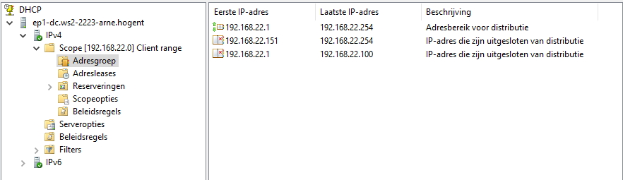

Verder bestaan er **drie reserveringen** voor alle servers binnen de opstelling. Deze zijn eigenlijk niet in gebruik (?) aangezien de servers hun IP adres lokaal toegekend krijgen.

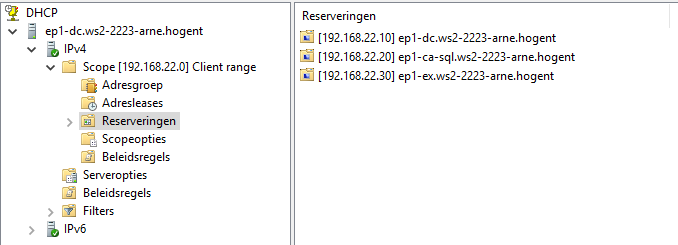

De DHCP-server deelt niet alleen IP adressen uit, maar ook het adres van de **Default Gateway** en de **DNS-servers** (voorlopig maar één dns server). Zo weten DHCP clients wie de Default Gateway naar buiten *(het internet)* is en waar ze de IP adressen van opgevraagde URLs kunnen opvragen.

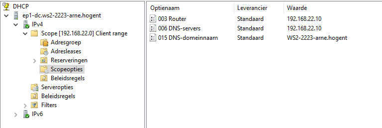

##### 1.3.2.4. Web Server (IIS)

Op de webserver is **één site** geconfigureerd met als naam `Default Web Site`. De website is beschikbaar op poort `443`. Om naar de website te surfen kan er gebruik gemaakt worden van de domeinnaam `www.ws2-2223-arne.hogent`. Om dit mogelijk te maken werden er **twee DNS records** aangemaakt. Een **A-record** in de forward lookup zone met als naam `www`, gebonden aan `192.168.22.10` en een bijhorend **PTR-record** in de reverse lookup zone dat de binding bidirectioneel maakt. **SSL** wordt vereist op de site en **clientcertificaten** worden geaccepteerd.

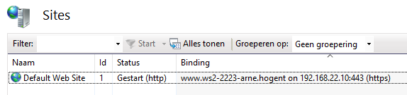

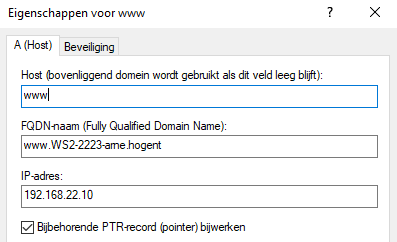

Om de HTTPS verbinding te realiseren werd er een **Domein Certificaat** aangemaakt en verleend door `EP1-CA-SQL`. We maken hier gebruik van een domein certificaat in plaats van een CA-signed certificaat omdat onze servers zich achter een firewall bevinden. Een bekende CA zal dus geen certificaat kunnen uitreiken aan deze server.

Het geïnstalleerde certificaat heeft als naam `domeinCert` en werd specifiek verleend aan `www.ws2-2223-arne.hogent` wat de **Fully Qualified Domain Name** is.

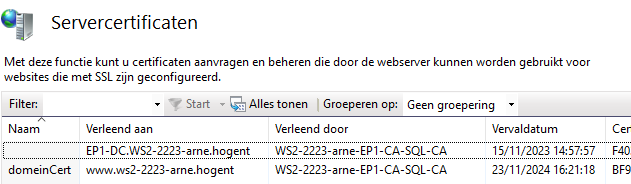

### 1.4. VM 2: Certificate Authority + SQL Server

De tweede virtuele machine in ons domein betreft de **Certificate Authority (CA)** en **SQL Server**. Deze server draait eveneens **Windows Server 2019** als besturingssysteem. De installatie is deze keer verschillend van de installatie op VM 1 in dat het een **headless** installatie, zonder GUI, is. De server zal gemanaged worden vanop `EP1-DC`, de Domeincontroller. Deze server is geconfigureerd met de **Certificate Authority rol**. Daarnaast is de server voorzien van een **SQL Server** installatie die ook gemanaged wordt vanaf de Windows Client en een **DNS server rol** die functioneert als redundante DNS server binnen ons domein.

#### 1.4.1. Configuratie in VirtualBox

Deze VM is volgens de minimum vereisten voorzien van **1 vCPU**, **1 GB vRAM** en een **dynamische vDisk van 50 GB**. 50 GB vDisk is in dit geval wat meer dan de minimum vereiste. Toch is er wat meer ruimte voorzien voor wanneer er databanken worden opgezet met SQL server. Dit zal bijna geen effect hebben op de performantie aangezien VirtualBox de virtuele schijf dynamisch kan alloceren.
Verder is de server, net zoals alle andere hosts in dit domein verbonden aan het `winnet` virtueel netwerk. Deze VM krijgt `192.168.22.20` als IP adres.

- **Hostname:** EP1-CA-SQL
- **OS:** Windows Server 2019 64-bit (Headless)
- **vCPUs:** 1
- **vRAM:** 1024 MB
- **vDisk:** 50 GB (Dynamically allocated)
- **Network:**
  - **Adapter 1:** Intern netwerk (winnet)
    - **IP adres:** 192.168.22.20

#### 1.4.2. Geïnstalleerde server rollen

Na de installatie van Windows Server 2019 voeren we de basisconfiguratie uit met het commando `SConfig`. De server werd toegevoegd aan het domein `WS2-2223-arne.hogent` en de hostname werd ingesteld op `EP1-CA-SQL`. De configuratie ziet er zo uit:

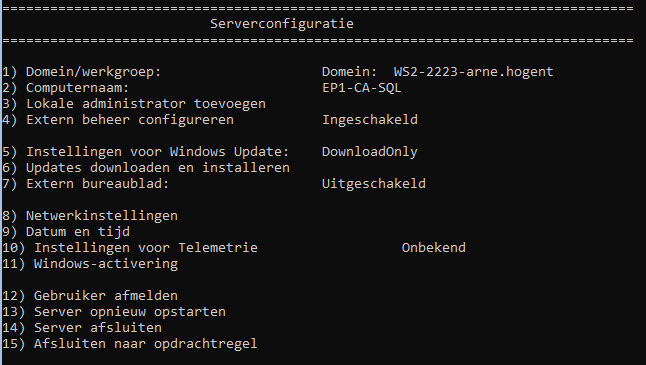

De **DHCP reservatie** op `EP1-DC` werd ook aangevuld met het MAC adres van `EP1-CA-SQL` en is nu actief.

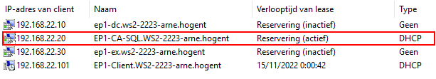

Ten slotte werd `EP1-CA-SQL` toegevoegd binnen Server beheer op `EP1-DC` opdat ik de server kan beheren vanop de domeincontroller.

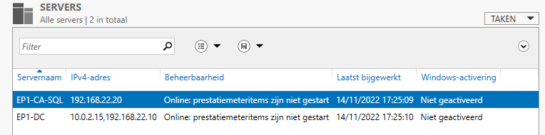

##### 1.4.2.1. Active Directory Certificate Services (AD CS)

Deze server draait de rol `Active Directory Certificate Services (AD CS)` binnen ons domein. Meerbepaald een Certificeringsinstantie of **Certificate Authority**. Deze rol bestaat uit verschillende modules dat men kan installeren. Ik heb gekozen om de server van onderstaande modules te voorzien. Samen voorzien ze ons domein van een Certificate Authority dat klaar staat om uitgebreidt te worden en volledige controle geeft over de certificaten. De module **Network Device Enrollment-service** werd niet geïnstalleerd omdat deze module betrekking heeft tot netwerkapparaten zoals routers die bovendien geen netwerkaccount hebben. Binnen de scope van dit domein is dit dus niet van toepassing.

1. **Certificate Authority (CA)**

    Deze module is de hoofdmodule binnen de rol en wordt gebruikt om certificaten uit te geven en te beheren.

2. **Internetregistratie voor CA's**

    Internetregistratie biedt een eenvoudige webinterface dat gebruikers toelaat om certificaten aan te vragen, te vernieuwen, certificaatintrekkingslijsten op te halen en zich in te schrijven voor smartcardcertificaten.

3. **Online Responder**

    Deze module maakt controlegegevens voor certificaatintrekking beschikbaar voor clients.

4. **Webservice Certificaatinschrijving**

    De webservice certificaatinschrijving laat toe dat gebruikers en computers zich **inschrijven voor certificaten** en deze vernieuwen. Het integreert IIS webservices met de  Deze module werkt nauw samen met onderstaande module.

5. **Webservice Certificaatinschrijvingsbeleid**

    Samen met de webservice certificaatinschrijving werkt deze module om gebruikers en computers binnen het domein op beleid gebaseerde automatische certificaatinschrijving te bieden.

Omdat we werken met een Active Directory Domain heb ik gekozen voor een `Ondernemings-CA`. Zo kan de CA gebruik maken van AD DS om het beheer van certificaten te vergemakkelijken. Verder is de server ook een `Root-CA` omdat deze server de eerste en enige CA is binnen ons domein.

De server gebruikt de default `RSA#Microsoft Software Key Storage Provider` als cryptografieprovider met een sleutellengte van `2048`. Voor de ondertekening van certificaten wordt het `SHA256` hashalgoritme gebruikt. Omdat deze opstelling tijdelijk is heeft de CA een geldigheidsperiode van vijf jaar. In productieomgevingen is het aangewezen deze periode niet te lang te maken.

De locatie van de certificaatdatabase en bijhorend logboek is de default locatie **C:\Windows\system32\CertLog**.

De server maakt gebruik van `Geïntegreerde Windows-authenticatie` omdat we ons in een Active Directory Domain bevinden.

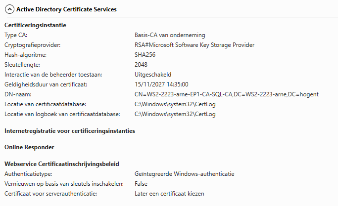
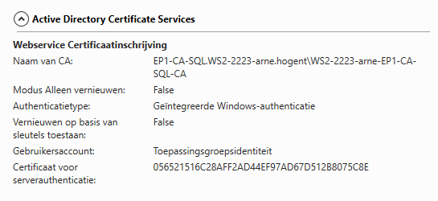

Verder installeerde ik op [VM 1: Domain controller](#13-vm-1-domain-controller) oftewel `EP1-DC` de **beheerhulpprogramma's voor externe servers** om de CA vanop de domeincontroller te kunnen beheren.

##### 1.4.2.2. SQL Server

##### 1.4.2.3. DNS

### 1.5. VM 3: Exchange

#### 1.5.1. Configuratie in VirtualBox

- **Hostname:** EP1-EX
- **OS:** Microsoft Exchange
- **vCPUs:** 2
- **vRAM:** 4096 MB
- **vDisk:** 30 GB (Dynamically allocated)
- **Network:**
  - **Adapter 1:** Intern netwerk (winnet)
    - **IP adres:** 192.168.22.50

#### 1.5.2. Geïnstalleerde server rollen

##### 1.5.2.1. Exchange mail server

### 1.6. VM 4: Windows Client

Op deze VM is **Windows 10 Pro** geïnstalleerd. Tijdens de installatie van Windows kiezen we voor `Set up for an organization`. Eens in Windows joinen we de Windows client aan ons domein en passen we de hostnaam aan naar `EP1-Client`. Dit is nodig om gebruik te kunnen maken van al de services die draaien in het domein.

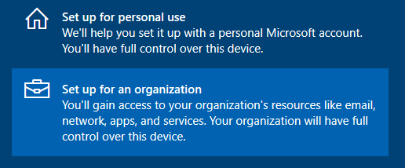

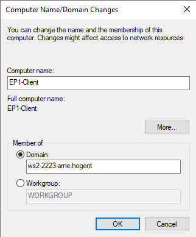

Deze client binnen het domein `ws2-2223-arne.hogent` zal gebruikt worden om functionaliteiten van de servers in het domein te testen en te verifiëren. Ten tweede is **SQL Server Management Studio** geïnstalleerd om de SQL server op `EP1-CA-SQL` te beheren.

#### 1.6.1. Configuratie in VirtualBox

- **Hostname:** EP1-Client
- **OS:** Windows 10 Pro
- **vCPUs:** 1
- **vRAM:** 2048 MB
- **vDisk:** 40 GB (Dynamically allocated)
- **Network:**
  - **Adapter 1:** Intern netwerk (winnet)
    - **IP adres:** Dynamic (DHCP)

#### 1.6.2. Geïnstalleerde software

##### 1.6.2.1. SQL Server Management Studio

### 1.7. Netwerk Diagram

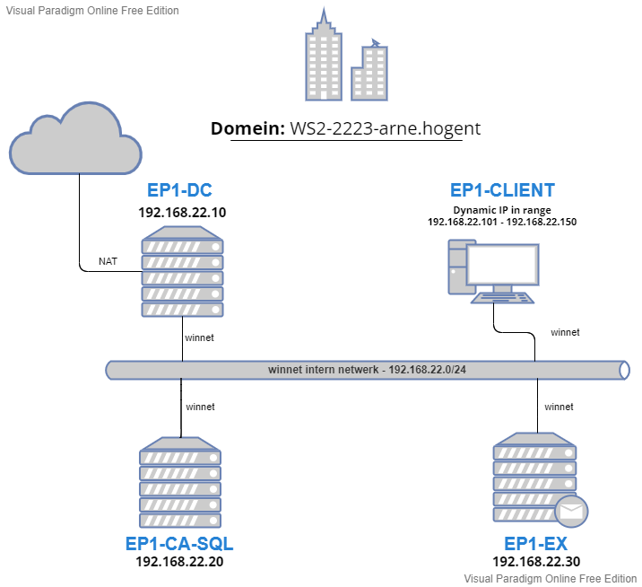

